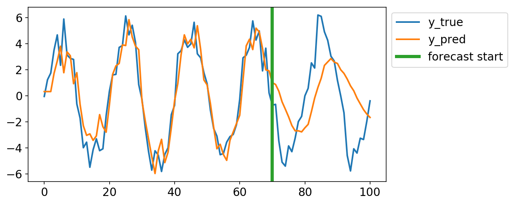

# skits
[](https://circleci.com/gh/EthanRosenthal/skits/tree/master)
[](https://badge.fury.io/py/skits)

A library for
**S**ci**K**it-learn-**I**nspired **T**ime **S**eries models.

The primary goal of this library is to allow one to train time series prediction models using a similar API to `scikit-learn`. Consequently, similar to `scikit-learn`, this library consists of `preprocessors`, `feature_extractors`, and `pipelines`. 

## Installation

Install with pip:

```commandline
pip install skits
```

## Preprocessors

The preprocessors expect to receive time series data, and then end up storing some data about the time series such that they can fully invert a transform. The following example shows how to create a `DifferenceTransformer` transform data, and then invert it back to its original form. The `DifferenceTransformer` subtracts the point shifted by `period` away from each point.

```python
import numpy as np
from skits.preprocessing import DifferenceTransformer

y = np.random.random(10)
# scikit-learn expects 2D design matrices,
# so we duplicate the time series.
X = y[:, np.newaxis] 

dt = DifferenceTransformer(period=2)

Xt = dt.fit_transform(X,y)
X_inv = dt.inverse_transform(Xt)

assert np.allclose(X, X_inv)
```

## Feature Extractors

After all preprocessing transformations are completed, multiple features may be built out of the time series. These can be built via feature extractors, which one should combine together into a large `FeatureUnion`. Current features include autoregressive, seasonal, and integrated features (covering the AR and I of ARIMA models).


## Pipelines

There are two types of pipelines. The `ForecasterPipeline` is for forecasting time series (duh). Specifically, one should build this pipeline with a regressor as the final step such that one can make appropriate predictions. The functionality is similar to a regular `scikit-learn` pipeline. Differences include the addition of a `forecast()` method along with a `to_scale` keyword argument to `predict()` such that one can make sure that their prediction is on the same scale as the original data.

These classes are likely subject to change as they are fairly hacky right now. For example, one must transform both `X` and `y` for all transformations before the introduction of a `DifferenceTransformer`. While the pipeline handles this, one must prefix all of these transformations with `pre_` in the step names.

Anywho, here's an example:

```python
import numpy as np
from sklearn.linear_model import LinearRegression
from sklearn.preprocessing import StandardScaler
from sklearn.pipeline import FeatureUnion

from skits.pipeline import ForecasterPipeline
from skits.preprocessing import ReversibleImputer
from skits.feature_extraction import (AutoregressiveTransformer, 
                                      SeasonalTransformer)
                               
steps = [
    ('pre_scaling', StandardScaler()),
    ('features', FeatureUnion([
        ('ar_transformer', AutoregressiveTransformer(num_lags=3)),
        ('seasonal_transformer', SeasonalTransformer(seasonal_period=20)
    )])),
    ('post_features_imputer', ReversibleImputer()),
    ('regressor', LinearRegression(fit_intercept=False))
]
                               
l = np.linspace(0, 1, 101)
y = 5*np.sin(2 * np.pi * 5 * l) + np.random.normal(0, 1, size=101)
X = y[:, np.newaxis]

pipeline = ForecasterPipeline(steps)

pipeline.fit(X, y)
y_pred = pipeline.predict(X, to_scale=True, refit=True)
```

And this ends up looking like:

```python
import matplotlib.pyplot as plt

plt.plot(y, lw=2)
plt.plot(y_pred, lw=2)
plt.legend(['y_true', 'y_pred'], bbox_to_anchor=(1, 1));
```


And forecasting looks like

```python
start_idx = 70
plt.plot(y, lw=2);
plt.plot(pipeline.forecast(y[:, np.newaxis], start_idx=start_idx), lw=2);
ax = plt.gca();
ylim = ax.get_ylim();
plt.plot((start_idx, start_idx), ylim, lw=4);
plt.ylim(ylim);
plt.legend(['y_true', 'y_pred', 'forecast start'], bbox_to_anchor=(1, 1));
```
